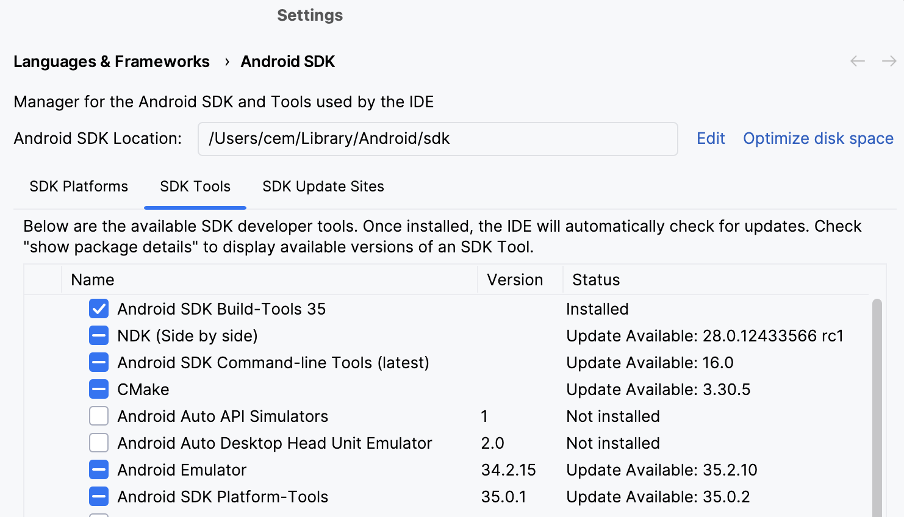
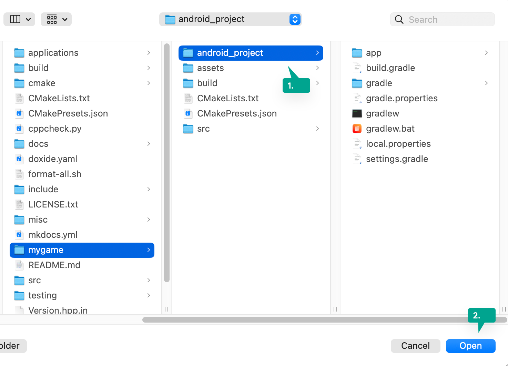

# Deploying to Android

Deploying your game to Android is best done using [Android Studio](https://developer.android.com/studio).

After installing Android Studio, use the SDK Manager to install the Android NDK, platforms and CMake:

<figure markdown="span">
    { width="400" }
</figure>

---

Then simply open the Android project that is included with your game (folder `android_project`):

<figure markdown="span">
    { width="400" }
</figure>

After Gradle is done with the setup, you should be able to build your game like any normal Android Studio project.

## Configuring the Project

Building the game produces an Android package (`.apk`) with all of the necessary metadata.

To change the various metadata such as package name and company, search for `#!cpp "TODO:"` entries within the
`android_project` folder and replace the property values as necessary.