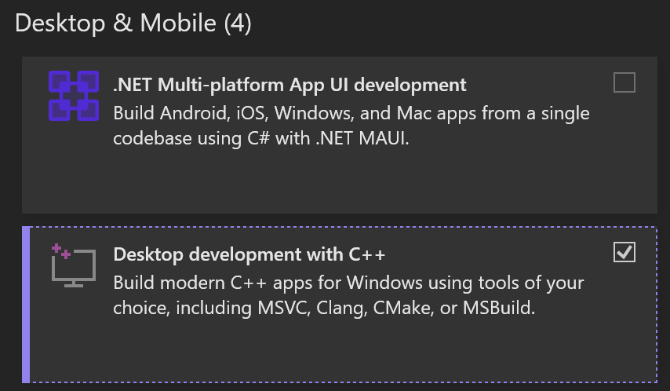
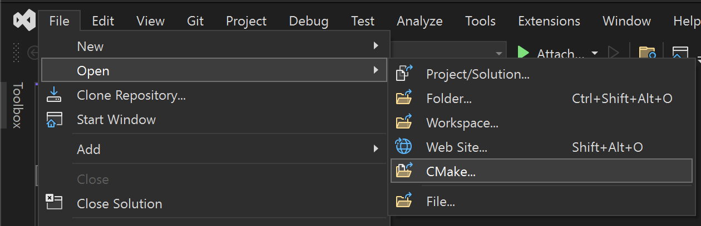
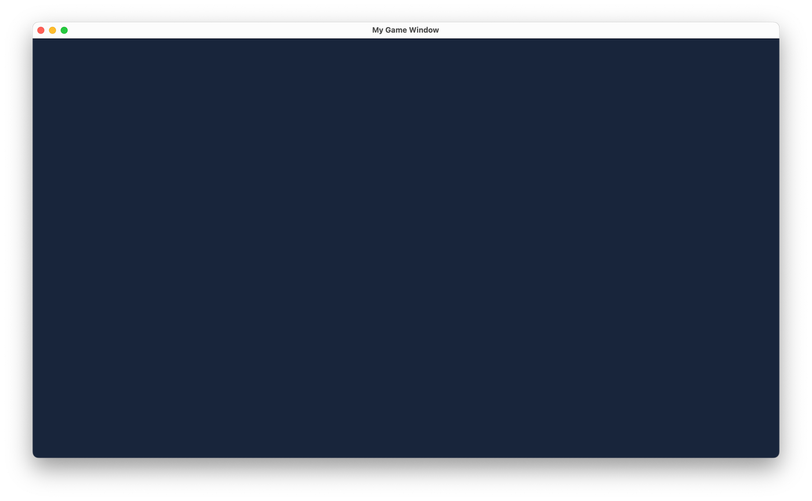

# Getting Started

## Requirements

Please ensure that the following tools and packages are installed on your corresponding system:

=== ":fontawesome-brands-windows: Windows"

    ### With Visual Studio

    * Install [Visual Studio](https://visualstudio.com)

    Then please ensure that the C++ desktop development package is included when you install it:

    <figure markdown="span">
      { width="300" }
    </figure>

    ### With VSCode and Clang

    1. Install [VSCode](https://code.visualstudio.com/) or [VSCodium](https://vscodium.com/)
    2. Install [Clang](https://github.com/llvm/llvm-project/releases)
    3. Install the following VSCode extensions:
        * [clangd](https://marketplace.visualstudio.com/items?itemName=llvm-vs-code-extensions.vscode-clangd)
        * [CMake Tools](https://marketplace.visualstudio.com/items?itemName=ms-vscode.cmake-tools)


=== ":simple-apple: macOS"

    First, ensure that [Homebrew](https://github.com/Homebrew/brew/releases/) is installed.
    Then install CMake:

    ```bash
    brew install cmake
    ```

    On macOS, the C++ toolchain is provided by Xcode, which can either be [downloaded directly](https://developer.apple.com/xcode/)
    **or** be installed via the command line:

    ```bash
    xcode-select --install
    ```

=== ":material-linux: Linux"

    On Linux, the C++ toolchain is provided by the system package manager.
    You additionally have to install X11 and Wayland development packages:

    ### APT-based

    ```bash
    sudo apt install cmake build-essential libwayland-dev libxkbcommon-dev \
                     wayland-protocols extra-cmake-modules xorg-dev libasound2-dev
    ```

    ### dnf-based

    ```bash
    sudo dnf install cmake gcc-c++ libX11-devel libXcursor-devel \
                     libXrandr-devel libXinerama-devel libXi-devel mesa-libGL-devel \
                     mesa-libGLU-devel wayland-devel libxkbcommon-devel \
                     wayland-protocols-devel extra-cmake-modules
    ```

Finally, clone the cerlib Git repository:

```bash
git clone https://github.com/cemderv/cerlib
cd cerlib
```

This is all there is to set up cerlib.
Some knowledge of (modern) C++ is recommended. CMake knowledge is not required.

# The game

The cerlib source code contains a folder named `mygame`, which is the game template, ready for development.

It consists of:

* `src`: Contains the game's source code
    * `src/MyGame.hpp`: The class that implements the game
    * `src/Main.cpp`: Contains the executable main function
* `CMakeLists.txt`: Sets up the game project
* `assets`: Contains the game's asset files, such as images and sounds

Let's have a look at `MyGame.hpp`:

```cpp
#include <cerlib.hpp>

struct MyGame : cer::Game {
  MyGame()
  {
    window = cer::Window{"My Game Window"};
  }

  void load_content() override
  {
    // Load the game's initial assets
  }

  bool update([[maybe_unused]] const cer::GameTime& time) override
  {
    // Update game logic. Use the time parameter as a reference point for
    // how much time has passed since the last update:
    // ...

    return true;
  }

  void draw([[maybe_unused]] const cer::Window& window) override
  {
    // Draw game content into window:
    // ...
  }

  cer::Window window;
};
```

The `Game` class represents the central game instance and is responsible for the entire game's lifecycle.
Your game derived from this class and is ready to run after it's created.

In the game's constructor, the main window is created.
You can override various methods of the Game class, each of which is called at a specific point.

The most important methods are:

* `load_content()`: Called once, namely when the game is ready to launch.
                    This method is responsible for loading the game's **initial** assets.
* `update()`: Called once every frame.
              Responsible for updating the game's logic.
* `draw()`: Called once every frame, **after** `update()`.
            Responsible for drawing the game's visuals.

## Running the game

=== ":fontawesome-brands-windows: Windows"

    Simply open the folder in Visual Studio, since Visual Studio has built-in support for CMake projects:

    <figure markdown="span">
      { width="500" }
    </figure>

    The game is then ready for development as per the usual Visual Studio workflow.

=== ":simple-apple: macOS"

    Use any IDE or editor that supports CMake, such as CLion or Visual Studio Code.

    If you wish to use Xcode instead, generate a project for it as follows:

    ```bash
    # Change to the game's directory
    cd mygame

    # Generate an Xcode project for the game
    cmake --preset xcode

    # Open the project in Xcode
    open build/xcode/MyGame.xcodeproj
    ```

=== ":material-linux: Linux"

    Use any IDE or editor that supports CMake, such as CLion or Visual Studio Code.

    Or `cd` into the game's directory and run CMake to configure and build the game:

    ```bash
    # Change to the game's directory
    cd mygame

    # Configure and build the game for development
    cmake --workflow --preset dev

    # Start the game
    (cd build && exec MyGame)
    ```

!!! note
    You can always build the game however you please, since it's a normal CMake project.
    You are not tied to any editor or IDE. This introduction simply guides you through a
    path of least resistance.

You should now see the game running:



Congratulations! You got your game running.

---

Related pages:

* [Content Management](game/content-management.md)
