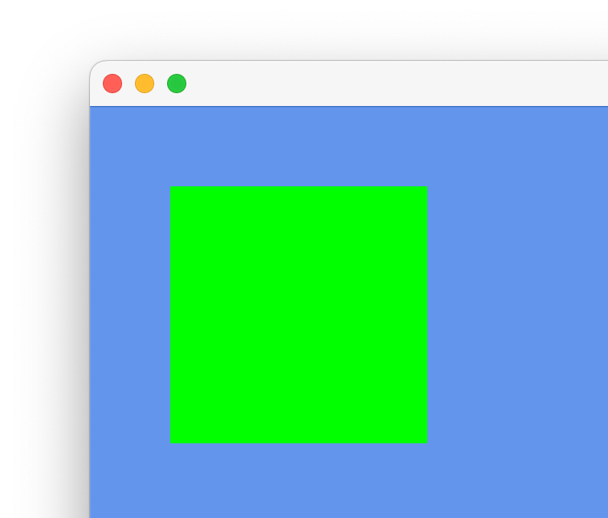

# Custom Shaders

Custom shading is necessary when you want to add certain effects to your sprites that can’t be achieved with cerlib’s built-in parameters. You might want to (de)saturate your sprites based on the game’s state, or add a power-up effect on top of your sprites which require more sophisticated equations. Further advanced effects include shaders where scene information is utilized, such as dynamic 2D lighting and shadowing.

With custom shaders, you can decide a sprite’s color at pixel-level with logic as sophisticated as you want (or, as the hardware allows). We’ll go over some examples of how you can easily add shaders to your game.

First, create a new file in your `assets` folder called `#!cpp "MyShader.shd"`, with the following contents:

```cpp
Vector4 main()
{
  return Vector4(0, 1, 0, 1);
}
```

This shader declares that it outputs a color with the RGBA components being `#!cpp 0, 1, 0, 1`, meaning it’s fully green and fully opaque.

Next, add a [`cer::Shader`](../api/Graphics/Shader/index.md) variable to your game and load it in the `load_content` method:

```cpp
struct MyGame : cer::Game
{
  void load_content() override
  {
    shader = cer::Shader{"MyShader.shd"};
  }
  
  // ...
  
  cer::Shader shader;
};
```

In the `draw` method, now set the shader as active using the [`cer::set_sprite_shader`](../api/Graphics/index.md#set_sprite_shader) function and draw the sprite as usual:

```cpp
void draw(const cer::Window& window) override
{
  cer::set_sprite_shader(shader);
  cer::draw_sprite(image, {100, 100});
}
```

You should now expect a fully green rectangle:

<figure markdown="span">
    { width="300" }
</figure>

Great!

Every sprite shader automatically has access to the sprite’s properties, for example:

* `sprite_image`: The sprite’s image, which corresponds to `cer::Sprite::image`
* `sprite_color`: The sprite’s color, which corresponds to `cer::Sprite::color`
* `sprite_uv`: The sprite’s image (UV) coordinates, which corresponds to `cer::Sprite::src_rect`

As a test, modify the shader so that it outputs the sprite’s UV coordinates as a color, where red is the X and green is the Y component:

```cpp
Vector4 main()
{
  return Vector4(sprite_uv, 0, 1);
}
```

This gives you the following image:

<figure markdown="span">
    { width="300" }
</figure>

As you can see, the upper-left corner is black, meaning that a `#!cpp Vector2(0, 0)` was the result. As we continue along the X-axis, the X component (red) increases. And as we continue along the Y-axis, the Y component (green) increases. So it makes sense that the bottom-right corner is yellow, since both components are `#!cpp 1`.

For example, the default sprite shader uses this coordinate to sample the sprite image. Its contents are simply this:

```cpp
return sample(sprite_image, sprite_uv) * sprite_color;
```

Imagine an image of size 32×32 was laid on top of the sprite’s rectangle. As we use the `sample` function, we pass the image coordinate to it (second argument). This coordinate is then used to read the image at that location.

The coordinates range from `#!cpp [0.0 .. 1.0]`, where `#!cpp 0` is the left-most or upper-most pixel and `1` is the right-most or bottom-most pixel location.

So `#!cpp sample(sprite_image, Vector2(0, 0))` would give us the pixel value at location `#!cpp {0 * 32, 0 * 32}`. 

On the other hand, sampling at `#!cpp Vector2(1, 1)` would give us the pixel value at location `#!cpp {1 * 32, 1 * 32}`.

Logically, `#!cpp Vector2(0.5, 0.5)` would then be the center pixel value. The GPU automatically performs the interpolation for us when we use the `sample` function, depending on which [`cer::Sampler`](../api/Graphics/Sampler/index.md) is active at that time.

To implement image tiling, you would simply pass an image coordinate that goes beyond the `#!cpp [0.0 .. 1.0]` range and use a [`cer::Sampler`](../api/Graphics/Sampler/index.md) that uses [`cer::ImageFilter::Repeat`](../api/Graphics/ImageFilter/index.md) or similar. To implement image scrolling, you simply add some offset to your image coordinates.

Let’s have some fun and add a shader parameter that we can control from within our game. Modify the shader code as follows:

```cpp
float red_intensity = 0.0;
float green_intensity = 0.0;
 
Vector4 Main()
{
  return Vector4(red_intensity, green_intensity, 0, 1);
}
```

We can set these parameters from wherever we want; the shader object stores them in a persistent manner. So we could set them in the `load_content` method of our game, or the update method, or even during draw. As long as it’s done before the shader is set as active, it doesn’t matter.

In this example we’re going to update the parameters in the `load_content` method, after the shader is loaded:

```cpp
void load_content() override
{
  // ...
  shader.set_value("red_intensity", 1.0f);
  shader.set_value("green_intensity", 1.0f);
}
```

We should now see a yellow rectangle, as expected:

<figure markdown="span">
    { width="300" }
</figure>

Let’s make it more interactive and update these values when the player presses certain keys. We do this in the `update` method:

```cpp
bool update(const cer::GameTime& time) override
{
  const float dt = float(time.elapsed_time);
 
  if (cer::is_key_down(cer::Key::Left))
  {
    const float current = *shader.float_value("red_intensity");
    shader.set_value("red_intensity", cer::clamp(current - dt, 0.0f, 1.0f));
  }
 
  if (cer::is_key_down(cer::Key::Right))
  {
    const float current = *shader.float_value("red_intensity");
    shader.set_value("red_intensity", cer::clamp(current + dt, 0.0f, 1.0f));
  }
 
  if (cer::is_key_down(cer::Key::Up))
  {
    const float current = *shader.float_value("green_intensity");
    shader.set_value("green_intensity", cer::clamp(current + dt, 0.0f, 1.0f));
  }
 
  if (cer::is_key_down(cer::Key::Down))
  {
    const float current = *shader.float_value("green_intensity");
    shader.set_value("green_intensity", cer::clamp(current - dt, 0.0f, 1.0f));
  }
 
  return true;
}
```

We modify the red intensity using the left/right arrow keys, and the green intensity using the up/down arrow keys.

To do that, we use the [`Shader::float_value`](../api/Graphics/Shader/index.md#float_value) method to obtain the parameter’s current value. Notice that we dereference it using `*`, because all `...value` methods in [`Shader`](../api/Graphics/Shader/index.md) return an `std::optional`. This is because it’s possible that we’re asking for the value of a parameter that doesn’t exist in the shader. This happens when we either specify an incorrect name or when the parameter was optimized away by the shader compiler.

A safer approach would be to use `#!cpp shader.float_value("red_intensity").value_or(0.0f)`. In our case, we know that this parameter exists, since we’re using it in the shader and therefore it can’t be optimized away.

Using [`Shader::set_value`](../api/Graphics/Shader/index.md#set_value) doesn’t have this problem. If a parameter name was incorrect or the parameter doesn’t exist, the method simply won’t do anything. In other words, it’s safe to use [`Shader::set_value`](../api/Graphics/Shader/index.md#set_value) even if you’re unsure about the parameter’s existence.

Depending on which key was pressed, we increment/decrement the corresponding intensity by the delta time. Additionally, we clamp the result to the range `#!cpp [0.0 .. 1.0]`.

We should now be able to modify the red and green components separately.
