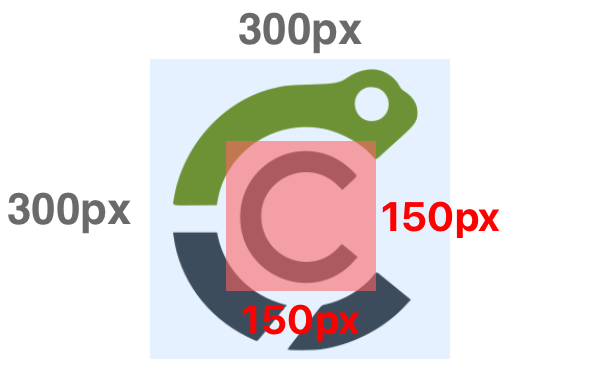

# Drawing Sprites

Drawing sprites is the primary task in a game's visual presentation.

In cerlib, the [`cer::draw_sprite`](../api/Graphics/index.md#draw_sprite) function is responsible for this.

There are two versions of [`cer::draw_sprite`](../api/Graphics/index.md#draw_sprite) available:

1. `#!cpp void draw_sprite(const Image& image, Vector2 position, Color color = white)`
2. `#!cpp void draw_sprite(const Sprite& sprite)`

Variant 1 is merely a shortcut version for variant 2; they both perform the same action.
We will focus on variant 2. As you can see, [`cer::draw_sprite`](../api/Graphics/index.md#draw_sprite) takes a single sprite parameter.

---

Let's have a look at the [`Sprite`](../api/Graphics/Sprite/index.md#sprite) structure:

```cpp
struct Sprite
{
  cer::Image                    image;
  cer::Rectangle                dst_rect;
  std::optional<cer::Rectangle> src_rect;
  cer::Color                    color = cer::white;
  float                         rotation;
  cer::Vector2                  origin;
  cer::Vector2                  scale = {1.0f, 1.0f};
  cer::SpriteFlip               flip  = cer::SpriteFlip::None;
};
```

Using a sprite, you are able to specify every detail of how it's drawn.
All coordinates and sizes of a sprite are expressed in pixels.

For example:

```cpp
const auto sprite = cer::Sprite {
    .image    = my_image,
    .dst_rect = { 200, 200, 128, 128 }, // Draw at {200, 200} with size {128, 128}
    .color    = cer::red,
    .flip     = cer::SpriteFlip::Horizontally,
};

cer::draw_sprite(sprite);
```

Which variant of `draw_sprite` you choose is up to your convenience.

## Destination and source

As you have seen, a sprite has two special properties called `dst_rect` and `src_rect`.
The destination specifies the sprite's area within the canvas (window).

A destination of `#!cpp { 200, 250, 128, 64 }` means that the sprite is drawn with its top-left corner at position
`#!cpp { 200, 250 }`, of size `#!cpp { 128, 64 }`.

This means that its right border will be at X-coordinate `#!cpp 200 + 128 = 328`, while its bottom border will be at Y-coordinate `#!cpp 250 + 64 = 314`.

The destination rectangle is often used to stretch or shrink (_scale_) a sprite, disregarding
its image size. For example, when you draw a sprite using `#!cpp cer::draw_sprite(image, {200, 200})`, the function calculates a destination rectangle for you, which ultimately
is `#!cpp { pos.x, pos.y, image_width, image_height }`.

The source rectangle on the other hand refers to coordinates **within the sprite's image**.
To illustrate this, let's take a look at the following image:

<figure markdown="span">
    { width="300" }
</figure>

The red rectangle represents the source rectangle.

In this case, it would be `{ 75, 75, 150, 150 }`.

The source rectangle is often used to implement sprite sheets and sprite animations. This allows multiple images to be stored in a single large image (_atlas_) and to still be drawn independently.

Such a technique is necessary when your game has hundreds or thousands of sprites in order to minimize texture changes and draw operations in the internal graphics API, which are an expensive operation.

One example is cerlib’s text rendering, whcih makes use of source rectangles. Since all characters are stored in a large image, each character in a string is drawn as a sprite that references its region in that image.

---

Related pages:

* [Drawing Text](drawing-text.md)
* [Alpha Blending](alpha-blending.md)
* [Samplers](samplers.md)
* [Transformation](transformations.md)