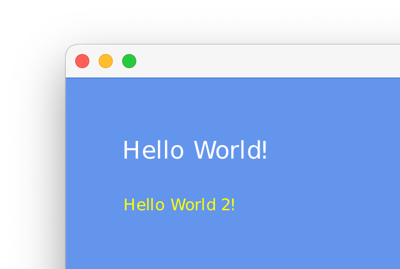
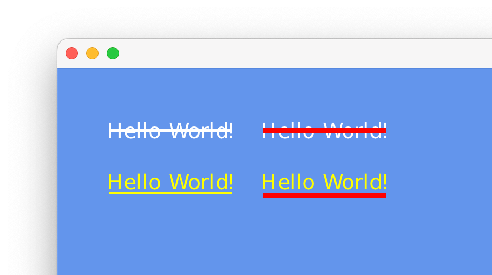

# Drawing Text

Drawing text is not that different from drawing sprites. However, since text can be understood as a group of sprites, where each character is a sprite, cerlib’s API provides you some extra functionality. In this chapter, we'll go through all functions one by one.

First, you need a font. cerlib comes with an embedded font that is directly available via the static [`Font::built_in`](../api/Graphics/Font/index.md#built_in) method. Alternatively, you may add a [`cer::Font`](../api/Graphics/Font/index.md) variable to your game and load it in `load_content` using the [`Font`](../api/Graphics/Font/index.md) constructor. Because it would not make much of a difference in the following examples, you can stick to the built-in font.

The central function is [`cer::draw_string`](../api/Graphics/index.md#draw_string),
which takes a [`Font`](../api/Graphics/Font/index.md), a size and the text to draw as a standard string.
The string is expected to be UTF-8-encoded.

In your game’s `draw` method, simply call [`draw_string`](../api/Graphics/index.md#draw_string) using the font object and give it some text:

```cpp
void draw(const cer::Window& window) override
{
  const auto font = cer::Font::built_in();
  
  // Draw some text at position {100, 100}
  cer::draw_string("Hello World!", font, /*font_size: */ 48, {100, 100});
  
  // Draw another text at position {100, 200}, and with color red
  cer::draw_string("Hello World 2!", font, /*font_size: */ 32, {100, 200}, cer::yellow);
}
```

This will draw some text as expected:

<figure markdown="span">
    { width="330" }
</figure>

## Text Decorations

For cases when text should be highlighted or otherwise hint at certain information, [`draw_string`](../api/Graphics/index.md#draw_string)
provides a way to decorate text, namely using the [`cer::TextDecoration`](../api/Graphics/TextDecoration/index.md) variant.

We can for example draw strikethrough or underlined text using the respective [`cer::TextStrikethrough`](../api/Graphics/TextStrikethrough/index.md) and [`cer::TextUnderline`](../api/Graphics/TextUnderline/index.md) types. Let’s see how that would look:

```cpp
const auto font = cer::Font::built_in();
const auto text = "Hello World!";
 
// Draw text with a strikethrough line
cer::draw_string(text, font, 48, {100, 100}, cer::white,
                 cer::TextStrikethrough{});
 
// Draw text with a strikethrough line, but specify a custom color and thickness
cer::draw_string(text, font, 48, {400, 100}, cer::white,
                 cer::TextStrikethrough {
                     .color = cer::red,
                     .thickness = 10.0f,
                 });
 
// Same for an underline.
cer::draw_string(text, font, 48, {100, 200}, cer::yellow,
                 cer::TextUnderline{});
 
cer::draw_string(text, font, 48, {400, 200}, cer::yellow,
                 cer::TextUnderline {
                     .color = cer::red,
                     .thickness = 10.0f,
                 });
```

The result:

<figure markdown="span">
    { width="330" }
</figure>

## Text Samplers

This assumes that you have read [Samplers](samplers.md).

It’s important to note that the active sampler
(set by [`cer::set_sampler`](../api/Graphics/index.md#set_sampler)) also affects how text is drawn.
This is by design, since it allows you to draw pixelated fonts easily.
Just set a nearest-neighbor sampler (e.g. [`cer::point_clamp`](../api/cer/index.md#point_clamp)) and then draw your text as usual.

Example:

```cpp
// Disable interpolation.
cer::set_sampler(cer::point_clamp);
cer::draw_string(...);
cer::draw_string(...);
// ...
 
// Enable interpolation again.
cer::set_sampler(cer::linear_repeat);
// ...
```

---

Related pages:

* [Handling Text](handling-text.md)
* [Samplers](samplers.md)