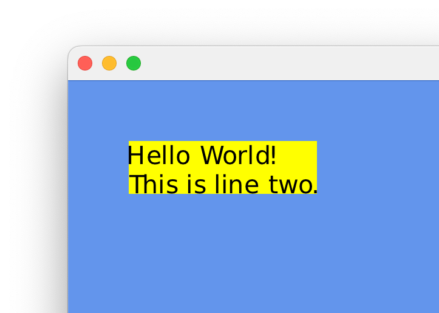
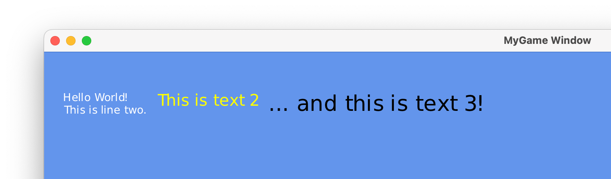
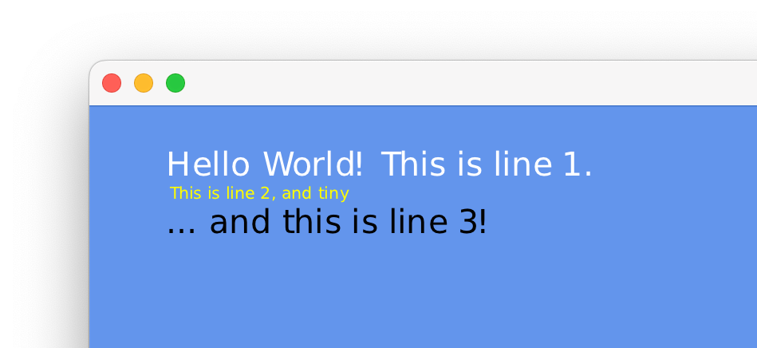

# Handling Text

This assumes that you have read [Drawing Text](drawing-text.md).

While drawing text is enough for many cases, there are some cases where you want to gain some
information about text you’re about to draw. Think of user interfaces where text elements are
neighbors of each other. This requires some kind of layouting algorithm, which in turn relies on
the size of text elements so that it can properly figure out where to put each element.
For such cases, [`cer::Font`](../api/Graphics/Font/index.md) provides methods such as measure, [`line_height`](../api/Graphics/Font/index.md#line_height) and [`for_each_glyph`](../api/Graphics/Font/index.md#for_each_glyph).

We will first go over the [`measure`](../api/Graphics/Font/index.md#measure) method.
It allows us to get the exact size of a text, in pixels, given a font and a size.
Modify our draw method as follows:

```cpp
void draw(const cer::Window& window) override
{
  const auto font      = cer::Font::built_in();
  const auto text      = "Hello World!\nThis is line two.";
  const auto font_size = 48u;
  
  // Measure the text we're going to draw.
  const auto text_size     = font.measure(text, font_size);
  const auto text_position = cer::Vector2{100, 100};
  
  // Draw a rectangle first to show that we know the text size correctly.
  cer::fill_rectangle({text_position, text_size}, cer::yellow);
  
  cer::draw_string(text, font, font_size, text_position, cer::black);
}
```

This should give us a yellow rectangle with black text on top:

<figure markdown="span">
    { width="330" }
</figure>

Imagine we had two draw multiple independent text objects next to one another, including a
margin between each of them. With this information we can now implement such a case, just like this:

```cpp
void draw(const cer::Window& window) override
{
  // Use the same font for all texts.
  const auto font = cer::Font::built_in();
 
  // These are the texts we have to draw.
  const auto texts = std::array{
    std::make_tuple("Hello World!\nThis is line two.", 32, cer::white),
    std::make_tuple("This is text 2", 48, cer::yellow),
    std::make_tuple("... and this is text 3!", 64, cer::black),
  };
 
  // Spacing between each text element.
  constexpr auto spacing = 30.0f;
 
  // This will be our "pen" that defines where we start drawing text.
  auto position_x = 50.0f;
 
  // For this example, we'll just draw text at a fixed Y-position.
  constexpr auto position_y = 100.0f;
 
  for (const auto& [text, size, color] : texts)
  {
    const auto text_size = font.measure(text, size);
 
    cer::draw_string(text, font, size, {position_x, position_y}, color);
 
    // Advance our pen position
    position_x += text_size.x + spacing;
  }
}
```

This will greet us with all texts neatly lined up:

<figure markdown="span">
    { width="700" }
</figure>

Next up is the [`line_height`](../api/Graphics/Font/index.md#line_height) method. It gives you the fixed height of the font itself, in pixels.
This is for example used to align text objects next to each other vertically (_“line by line”_).
Let’s see an example:

```cpp
void draw(const cer::Window& window) override
{
  const auto font = cer::Font::built_in();
 
  const auto texts = std::array{
    std::make_tuple("Hello World! This is line 1.", 48, cer::white),
    std::make_tuple("This is line 2, and tiny", 24, cer::yellow),
    std::make_tuple("... and this is line 3!", 48, cer::black),
  };
 
  // X and Y are swapped this time, since we're incrementally
  // drawing text downwards.
  constexpr auto position_x = 100.0f;
 
  auto position_y = 50.0f;
 
  for (const auto& [text, size, color] : texts)
  {
    const auto line_height = font.line_height(size);
 
    cer::draw_string(text, font, size, {position_x, position_y}, color);
 
    // Advance our pen position
    position_y += line_height;
  }
}
```

This gives us perfectly aligned text:

<figure markdown="span">
    { width="400" }
</figure>

And lastly, the most important of all: [`for_each_glyph`](../api/Graphics/Font/index.md#for_each_glyph).
This is the method all others are based on.
Given a text, size and an [`std::function`](https://en.cppreference.com/w/cpp/utility/functional/function),
it allows you to iterate each glyph of a string and perform an arbitrary action.
For each iteration, your function gets information about the glyph such as codepoint and position as parameters. 

Let’s look at its signature:

```cpp
void for_each_glyph(std::string_view text,
                    uint32_t size,
                    const std::function<bool(uint32_t codepoint, Rectangle rect)>& action) const;
```

We see that we have to give it a function that takes the glyph’s Unicode codepoint and its occupied
area within the text, in pixels.
Additionally, it has to return a bool value to indicate whether to keep going.
If it returns false, the iteration stops after that glyph. [`for_each_glyph`](../api/Graphics/Font/index.md#for_each_glyph) itself returns nothing,
as it's just a forward iteration method.

With this, we could even implement a custom text rendering function.
But for this example we’ll keep it simple and print glyph information to the console, just to show that it works:

```cpp
void draw(const cer::Window& window) override
{
  const auto font      = cer::Font::built_in();
  const auto font_size = 32u;
  const auto text      = "Hello\nWorld!";
 
  font.for_each_glyph(text, font_size, [](uint32_t codepoint, cer::Rectangle rect) {
    cer::log_info("Got glyph {} at {}", char(codepoint), rect);
    return true; // Keep going
  });
}
```

Which prints the following to the console:

```cpp
Got glyph H at [ x=0; y=4.5167785; width=16; height=21 ]
Got glyph e at [ x=20.67114; y=9.516779; width=15; height=17 ]
Got glyph l at [ x=37.583893; y=4.5167785; width=4; height=21 ]
Got glyph l at [ x=45.221478; y=4.5167785; width=4; height=21 ]
Got glyph o at [ x=52.859062; y=9.516779; width=15; height=17 ]
Got glyph W at [ x=0; y=36.516777; width=27; height=21 ]
Got glyph o at [ x=25.570469; y=41.516777; width=15; height=17 ]
Got glyph r at [ x=42.389263; y=41.516777; width=10; height=16 ]
Got glyph l at [ x=53.691277; y=36.516777; width=4; height=21 ]
Got glyph d at [ x=61.328857; y=36.516777; width=14; height=22 ]
Got glyph ! at [ x=78.77853; y=36.516777; width=3; height=21 ]
```

We can observe that the X-position increments steadily until the `W` is encountered, which starts at a new line.
X is therefore reset, and Y is now offset. X increments steadily while Y remains the same until
the end of the string.

There is one use case where [`for_each_glyph`](../api/Graphics/Font/index.md#for_each_glyph) really shines, which is hit detection.
When implementing UI controls such as text boxes, the correct position for the caret must be determined.
This is only possible when we have information about each character’s location inside such a text box.
Whenever a user clicks somewhere inside the text box, we can iterate its text and compare the
clicked position to each glyphs area.

Conversely, when the caret’s position is already known and the user presses the left or right key to go
to the previous or next glyph, we can correctly move the caret, since we know the exact positions of each glyph.

## DPI-aware Text

The text size we specify in text-related functions is given in pixels. However, different displays might have different pixel densities (DPI).
cerlib does not handle drawing at different densities itself, but gives you the information so that you can
handle it.
When working with text, you should obtain the current DPI scaling factor using [`Window::pixel_ratio`](../api/Game/Window/index.md#pixel_ratio) of
the main / current window.
This gives you a floating-point value by which you have to scale the font size, so that you get the “real” pixel size for that window’s display.

An example:

```cpp
auto font_size      = 32u;
auto pixel_ratio    = my_window.pixel_ratio();
auto real_font_size = uint32_t(float(font_size) * pixel_ratio);
 
cer::draw_string("Hello World!", my_font, real_font_size);
```

The same is true for other text-related functions such as [`Font::measure`](../api/Graphics/Font/index.md#measure) and [`Font::for_each_glyph`](../api/Graphics/Font/index.md#for_each_glyph).

---

Related pages:

* [Drawing Text](drawing-text.md)
