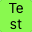
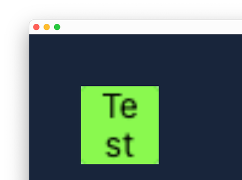
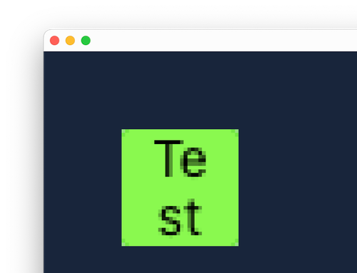
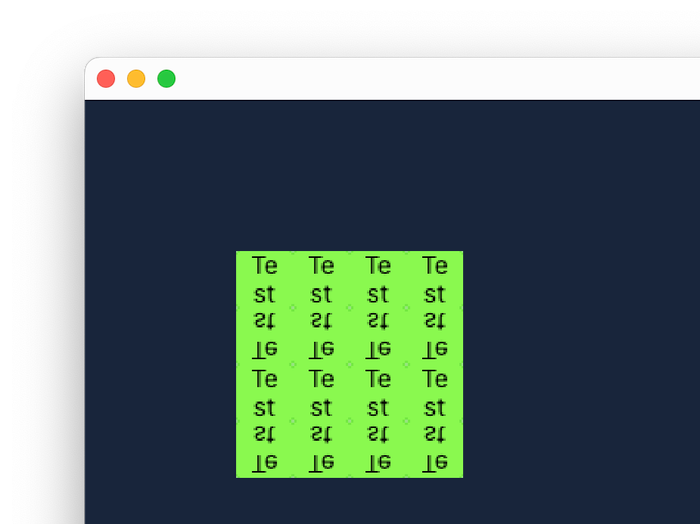

# Samplers

[Drawing Sprites](drawing-sprites.md) talks about how the destination rectangle is able to
scale a sprite, disregarding its image size. This is thanks to image interpolation, which
is controllable via the `cer::set_sampler` function.

To illustrate this, let's add a low-resolution image, for example this 32x32 dummy image:

<figure markdown="span">
    
</figure>

A [`cer::Sampler`](../api/Graphics/Sampler/index.md#sampler) describes how an image is interpolated and repeated across image coordinate
boundaries. This is especially useful if you desire a pixelated look for your game, or for
effects such as texture scrolling.

The [`set_sampler`](../api/Graphics/index.md#set_sampler) function can be called at any time; cerlib remembers its state until it's changed again. Now try loading the 32x32 image and draw it upscaled using a destination rectangle:

```cpp
void load_content() override
{
    image = cer::Image{"Test32x32.png"};
}

void draw(const cer::Window& window) override
{
    // Draw the image at position {200, 200}, but scale it up to 300x300 pixels.
    cer::draw_sprite(cer::Sprite {
        .image    = image,
        .dst_rect = { 200, 200, 300, 300 },
    });
}
```

The image should now be upscaled and blurry, since by default cerlib uses linear interpolation:

<figure markdown="span">
    { width="300" }
</figure>

Now set a sampler **before** drawing the sprite that disables image interpolation:

```cpp
void draw(const cer::Window& window) override
{
    cer::set_sampler(cer::Sampler {
        .filter    = cer::ImageFilter::Point,
        .address_u = cer::ImageAddressMode::ClampToEdgeTexels,
        .address_v = cer::ImageAddressMode::ClampToEdgeTexels,
    });

    cer::draw_sprite(cer::Sprite {
        .image    = image,
        .dst_rect = { 200, 200, 300, 300 },
    });
}
```

This will result in a pixelated sprite:

<figure markdown="span">
    { width="300" }
</figure>

`filter` refers to the interpolation mode. `Point` uses [nearest neighbor filtering](https://en.wikipedia.org/wiki/Nearest-neighbor_interpolation). The `address_u` and `address_v` fields refer to how the image is sampled when coordinates fall outside the image bounds.
`ClampToEdgeTexels` for example specifies that every pixel that lies outside the image bounds
results in the image border's color. `address_u` specifically refers to pixels in the X-axis
of the image, while `address_v` refers to pixels in the Y-axis.

As an example, try changing the `address_u` value to `Repeat` and `address_v` to `Mirror`:

```cpp
void draw(const cer::Window& window) override
{
    cer::set_sampler(cer::Sampler {
        .filter    = cer::ImageFilter::Point,
        .address_u = cer::ImageAddressMode::Repeat,
        .address_v = cer::ImageAddressMode::Mirror,
    });
  
    cer::draw_sprite(cer::Sprite {
        .image    = image,
        .dst_rect = {200, 200, 300, 300},
        .src_rect = cer::Rectangle{0, 0, 128, 128},
    });
}
```

We can now see that the image is repeated across the X-axis and mirrored across the Y-axis:

<figure markdown="span">
    { width="300" }
</figure>

The image repeats four times, since we specified a source rectangle size of 128x128 pixels,
while the image is 32x32.
Remember that you could use the source rectangle to implement texture scrolling.
If you are curious, try using the game's total running time ([`GameTime::total_time`](../api/Game/GameTime/index.md)) as
the X or Y value for the source rectangle's position.

The default sampler (when none is set) is equivalent to [`cer::linear_clamp`](../api/cer/index.md#linear_clamp) (see below).

## Built-in Samplers

cerlib provides the following predefined samplers, all of which are `constexpr`:

```cpp title="cer::point_repeat"
{
    .filter    = ImageFilter::Point,
    .address_u = ImageAddressMode::Repeat,
    .address_v = ImageAddressMode::Repeat,
}
```

```cpp title="cer::point_clamp"
{
    .filter    = ImageFilter::Point,
    .address_u = ImageAddressMode::ClampToEdgeTexels,
    .address_v = ImageAddressMode::ClampToEdgeTexels,
}
```

```cpp title="cer::linear_repeat"
{
    .filter    = ImageFilter::Linear,
    .address_u = ImageAddressMode::Repeat,
    .address_v = ImageAddressMode::Repeat,
}
```

```cpp title="cer::linear_clamp"
{
    .filter    = ImageFilter::Linear,
    .address_u = ImageAddressMode::ClampToEdgeTexels,
    .address_v = ImageAddressMode::ClampToEdgeTexels,
}
```

Using a predefined sampler is as simple as:

```cpp
cer::set_sampler(cer::point_repeat);
```
