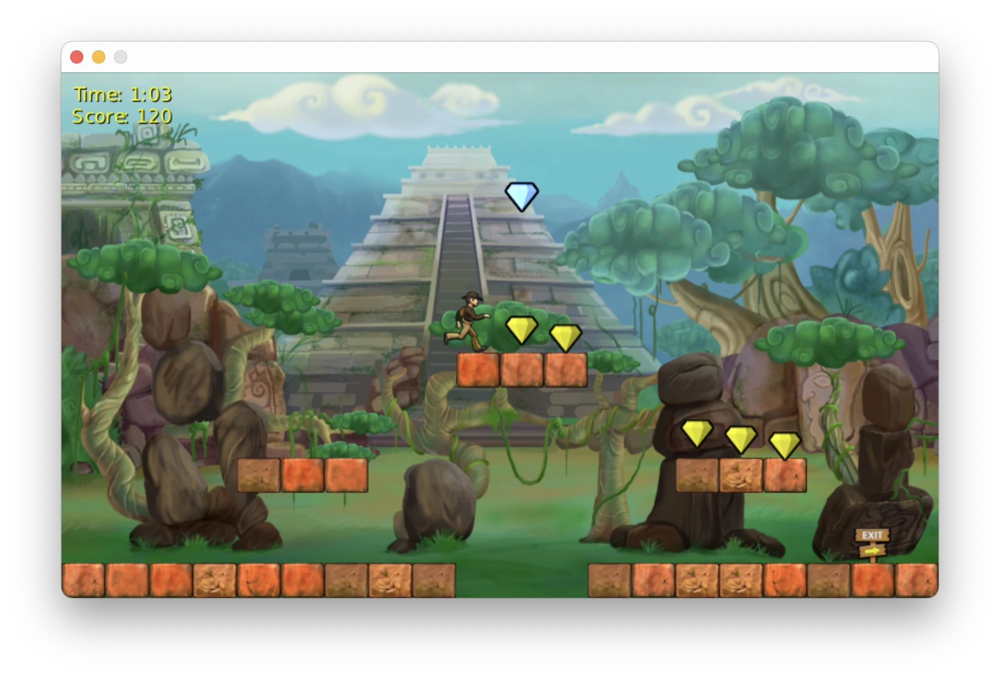

# Home

{ width="300" }
{ width="300" }

#### A lightweight library for 2D game development using modern C++

cerlib focuses on a simple design and at the same time offers you the possibility to design your game architecture your way.

<figure markdown="span">
    { width="800" }
</figure>

## Features

<div class="grid cards" markdown>


-   :fontawesome-solid-dove:{.feature} __Open Source__

    ---

    Permissive Apache 2.0 license with no royalties attached

    [:octicons-arrow-right-24: GitHub Repository](https://github.com/cemderv/cerlib)

-   :material-linux:{.feature} __Cross-platform__

    ---

    Runs on multiple platforms, including
 
    :fontawesome-brands-windows:, :material-apple:, :material-linux:, :material-android:
    and :simple-webassembly: WebAssembly

-   :fontawesome-solid-gears:{.feature} __App framework__

    ---

    Based on latest SDL3, with an easy-to-use input handling API, window management and event handling

-   :material-image:{.feature} __Efficient sprite and UTF-8 text rendering__
 
    ---

    Utilizing the platform's native graphics API and GPU
 
-   :material-brush:{.feature} __Custom sprite shading__

    ---

    Simple and safe shading language that transpiles to native shading languages

-   :material-square-root:{.feature} __Integrated math library__

    ---

    From colors to vectors to matrices
 
-   :material-volume-medium:{.feature} __Audio playback__

    ---

    Including faders and channels for playback control

-   :material-package-variant:{.feature} __Content management__

    ---

    Load common formats such as .png, .jpg, .bmp, .dds, .ttf, .wav, .mp3, .ogg, .flac
    and many more

-   :material-star-shooting:{.feature} __Particle systems__

    ---

    Customizable behaviors via emitters, modifiers and shapes

-   :material-view-grid-outline:{.feature} __First-class support for [ImGui](https://github.com/ocornut/imgui)__

    ---

    Automatically available in your game, simply `#!cpp #include <imgui.h>` and use it

-   :material-bug:{.feature} __Graphics debugger support__

    ---

    Use [RenderDoc](https://renderdoc.org) for in-depth frame analysis and shader debugging

</div>

---

```cpp title="Minimal Example" linenums="1"
#include <cerlib.hpp>
#include <cerlib/Main.hpp>

using namespace cer;

struct MyGame : Game
{
    void load_content() override
    {
        image = Image{"MyImage.png"};
    }

    bool update(const GameTime& time) override
    {
        // Update game logic. Use the time parameter as a reference point for
        // how much time has passed since the last update:
        // ...
        return true;
    }

    void draw(const Window& window) override
    {
        // Draw game content into 'window':
        // ...
        draw_sprite(image, {100, 200}, white);
    }

    Window window = Window{"My Game Window"};
    Image image;
};

int main() {
  // Create and run your game.
  return run_game<MyGame>();
}
```

## Getting Started

For a detailed introduction, please visit [Getting Started](getting-started.md).

## What it does **not** provide

- A full-fledged 2D game engine
- A level editor
- An entity-component-system or any kind of scene representation
- A physics API
- A networking API (candidate for future versions)
- 3D rendering (candidate for future versions)

---

In short, cerlib lets you define your game architecture however you desire.
It does not impose a strict model on the game's code.
It provides every audiovisual aspect necessary to comfortably make a 2D game.

## Platform Support

| OS | Architecture | Graphics Backend |
|----|--------------|------------------|
| :fontawesome-brands-windows: Windows | x64, ARM64 | OpenGL ≥ 3.0 |
| :material-linux: Linux | x64, ARM64 | OpenGL ≥ 3.0 |
| :material-android: Android | All ABIs | OpenGL ES ≥ 3.0 |
| :simple-webassembly: Web | WebAssembly | WebGL 2 |
| :simple-apple: macOS | Intel, Apple Silicon | OpenGL ≥ 3.0 |
| :material-apple-ios: iOS, iPadOS, visionOS | ARM64 | Metal - [_In Development_](https://github.com/cemderv/cerlib/issues/3) |

## Supported compilers

cerlib has been tested and is confirmed to work with the following compilers:

| Compiler                                    | Required Version  |
|---------------------------------------------|-------------------|
| :fontawesome-brands-windows: MSVC           | 2022              |
| :fontawesome-solid-dragon: Clang, Clang-cl  | ≥ 16.0.6          |
| :simple-gnu: GCC                            | ≥ 11.4            |
| :material-apple: Apple Clang                | ≥ 15              |

## Contributing and Feedback

Please see [Contributing](contributing.md) for further details on how to contribute to cerlib.
